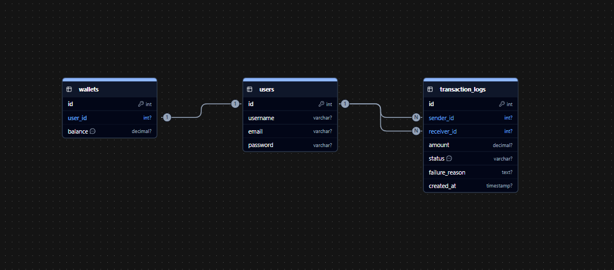

# LumaPay — Peer-to-Peer Lending Platform

LumaPay peer-to-peer wallet application that simulates real-time fund transfers between users while maintaining a mandatory, immutable audit log of all transactions. It enables users to:

-Create secure user accounts
-Track their lending and borrowing activities
-Transfer funds to other users securely
-View transaction history with real-time balance updates
-Monitor transaction status (Success/Failed)

---
## Hosted Links:
- https://lumapay.netlify.app/

## Demo Video
- Link:- https://youtu.be/Sej-m6td35Q

## Table of Contents

- [Project Overview](#project-overview)  
- [Features](#features)  
- [Tech Stack](#tech-stack)  
- [Setup Instructions](#setup-instructions)  
- [Prerequisites](#prerequisites)  
- [Backend Setup](#backend-setup)  
- [Frontend Setup](#frontend-setup)  
- [API Documentation](#api-documentation)  
- [Database Schema](#database-schema)  
- [Environment Configuration](#environment-configuration)  
- [Running the Application](#running-the-application)  
- [Deployment](#deployment)  
- [AI Tool Usage Log](#ai-tool-usage-log)  

---

## Project Overview

LumaPay is a peer-to-peer lending and wallet platform designed to simulate real-time financial transactions with strong emphasis on security, auditability, and user experience.

Users can:
- Create secure user accounts
- Transfer funds in real time
- Track sent and received transactions
- View immutable transaction audit logs
- Monitor transaction status (SUCCESS / FAILED)

---

## Features

### Authentication & Authorization
- User registration with email validation
- Secure login using JWT (SimpleJWT)
- Password hashing with industry-standard algorithms
- Protected API endpoints
- Logout with token invalidation

### Transaction Management
- Send money using recipient email
- Real-time balance updates (WebSockets)
- Transaction history with filtering & sorting
- Status tracking (SUCCESS / FAILED)
- Timestamped immutable audit logs
- Separate sent & received transaction views

### User Interface
- Responsive UI (mobile, tablet, desktop)
- Tailwind CSS styling
- Real-time form validation
- Loading states & notifications
- Dashboard with balance card and transaction table

### Security
- CORS protection
- ORM-based SQL injection prevention
- Secure password storage
- JWT token expiration handling
- Environment-based configuration

---

## Tech Stack

Backend
- Framework: Django 6.0
- API: Django REST Framework
- Authentication: SimpleJWT
- Database: PostgreSQL
- Real-Time Communications: WebSockets

Frontend
- Framework: React 19
- Routing: React Router
- HTTP Client: Axios (with interceptors)
- Styling: Tailwind CSS
- State Management: React Context API

---

## Setup Instructions

### Prerequisites
- Python 3.8+
- Node.js 16+
- npm or yarn
- Git

### Backend Setup
```bash
git clone <repository-url>
cd LumaPay/backend
python -m venv venv

# macOS / Linux
source venv/bin/activate

# Windows (PowerShell)
# .\venv\Scripts\Activate.ps1

pip install -r requirements.txt
cp .env.example .env
python manage.py migrate
# (Optional) create superuser
python manage.py createsuperuser
python manage.py runserver
```
Backend runs at: http://127.0.0.1:8000

### Frontend Setup
```bash
cd frontend
npm install
# create .env for dev
# Example .env:
# REACT_APP_API_BASE_URL=http://127.0.0.1:8000
npm start
```
Frontend runs at: http://localhost:3000

---

## API Documentation

Base URL (development): http://127.0.0.1:8000

Authentication
- POST /signup/ — Register new user
- POST /login/ — Obtain JWT tokens
- POST /profile/ — Get/update profile (Auth: Bearer <access_token>)

Transactions
- GET /transactions/ — List transactions  
  Query params:
  - type=SENT | RECEIVED | ALL
  - status=SUCCESS | FAILED | ALL
- POST /transfer/ — Transfer funds (Auth: Bearer <access_token>)

WebSocket Endpoint
- ws://127.0.0.1:8000/ws/transactions/?user_id=<user_id>

Postman collection (example):
https://pocket-book-developers.postman.co/workspace/AlignTurtle~0d185443-c0ba-4089-a37e-f383e9833312/collection/32954460-a00b62cb-f221-424c-8d64-26d550f6f00e

---

## Database Schema



---

## Environment Configuration

Backend (.env)
```
SECRET_KEY=django-insecure-example
DEBUG=False
POSTGRES_DB=exampledb
POSTGRES_USER=dbuser
POSTGRES_PASSWORD=strongpassword123
POSTGRES_HOST=db.examplecloud.com
POSTGRES_PORT=5432
POSTGRES_SSLMODE=require
```

Frontend (.env)
```
REACT_APP_API_BASE_URL=https://api.example.com
REACT_APP_WS_BASE_URL=wss://ws.example.com
```

Note: In the project codebase the frontend may also use Vite env keys (e.g. VITE_API_BASE_URL). Ensure consistency.

---

## Running the Application

1. Start the backend (migrations applied, .env configured)
2. Start the frontend with correct API/WS env vars
3. Use seeded/test accounts or register new users
4. Perform transfers and verify immutable transactions & audit logs

---

## Deployment

- Backend: Deploy Django app to preferred host (Heroku, DigitalOcean, AWS). Use environment variables for secrets and DB credentials.
- Database: Use managed PostgreSQL in production; enable SSL & backups.
- Frontend: Build React app and serve via CDN or static host (Netlify, Vercel).
- WebSockets: Ensure host supports long-lived connections (or use a WebSocket gateway).
- Use CI/CD to run tests, linting, and build steps.

---

## AI Tool Usage Log

Specific Tasks Where AI Tools Were Used

### Frontend UI Generation
- Used **v0** to generate initial frontend UI layouts and Tailwind CSS scaffolding.  
- Helped speed up component structure and styling setup.

### Backend Debugging & Logic Improvements
- Used **ChatGPT** for debugging backend issues, fixing API-related bugs, and refining error-handling logic.  
- Assisted in implementing and validating WebSocket logic for real-time updates.  
- Helped refactor backend code blocks for better readability and correctness.

### Boilerplate Code Generation
- Used **GitHub Copilot** to generate boilerplate code for Django models, serializers, and views.  
- Reduced repetitive manual coding while keeping final control with manual review.

All AI-generated outputs were manually reviewed, tested, and validated to ensure correctness, security, and adherence to project requirements.

## Effectiveness Score

**Score:** 4 out of 5

### Justification
The use of AI tools significantly reduced development time by accelerating boilerplate generation, UI scaffolding, and debugging workflows. While AI-generated code required manual verification and refinement—particularly for business logic and security-sensitive areas the overall productivity gain was substantial, resulting in a faster and more structured development process.
---